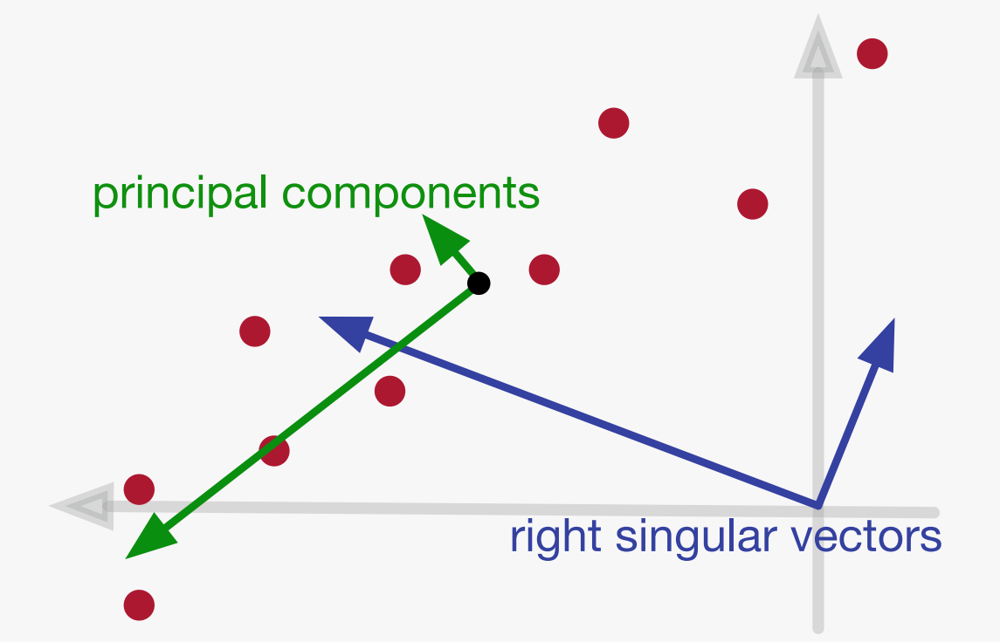

# 降维

## 奇异值分解

### 用向量表示数据

数据集通常被表示成矩阵 $A\in\R^{n\times d}$，不妨记 $A = \begin{bmatrix}\vec a_1^\intercal \\\vec a_2^\intercal\\\vdots\\\vec a_n^\intercal\end{bmatrix}$，每个列向量 $\vec a_i\in\R^d$ 都是一个数据

> 虽然老师上课原话 $\vec a_i$ 是行向量，但是作者认为行向量是一个非常不自然的东西，就擅自将它们都转置为列向量。正好 $\vec{\text{ }}^\intercal$ 记号也能提醒我这个向量是一个行向量

**奇异值分解**会找到一个 *最适合*（"best-fitting"）的 $k$ 维 **线性子空间**

*最适合* 这里指这些点到这个子空间距离的平方和最小，就跟最小二乘法一样。也就是说找到一个线性子空间 $S$，使得：
$$
S = \arg\min_{S \text{ is a } k-\text{dim subspace }}\sum_{i = 1}^n{\rm dist}^2(\vec a_i, S)
$$
> $\arg$ 表示主值，这里 $\arg\min_S f(S)$ 表示当 $f(S)$ 取到最小值时 $S$ 的值，有多个最小值时任取一个

考虑勾股定理，这里有 ${\rm dist}^2(\vec a_i, S) + {\rm length}^2({\rm proj}(\vec a_i, S)) = {\rm length}^2(\vec a_i)$，而 ${\rm length}(\vec a_i)$ 是固定值，所以 $S$ 的一个等价表述为：
$$
\begin{aligned}
S &= \arg\min_{S \text{ is a } k-\text{dim subspace }}\sum_{i = 1}^n{\rm dist}^2(\vec a_i, S) \\
&= \arg\min_{S \text{ is a } k-\text{dim subspace }}\left(\sum_{i = 1}^n{\rm length}^2(a_i) - \sum_{i = 1}^n{\rm length}^2({\rm proj}(\vec a_i, S))\right)\\
&= \arg\max_{S \text{ is a }k-\text{dim subspace}}\sum_{i = 1}^n{\rm length}^2({\rm proj}(\vec a_i, S))
\end{aligned}
$$

### 奇异向量与奇异值

回忆线性代数中的 **范数**。若 $p\geq 1$，则记 $p$ 范数为 $\norm{\vec a}_p = \left(\sum_{i = 1}^n\abs{\vec a_i}^p\right)^{\frac 1p}$。那么有：
$$
\norm{\vec a}_2 = \sqrt{\sum_{i = 1}^na_i^2}\\
\norm{\vec a}_1 = \sum_{i = 1}^n\abs{a_i}\\
\norm{\vec a}_\infty = \max_{i = 1}^n\abs{a_i}\\
$$
在本章节，范数默认为 $2$ 范数，即默认 $\norm{\vec a} = \norm{\vec a}_2$。

（额外地，定义 $\norm{\vec a}_0$ 是 $\vec a$ 中非零元的数目）

注意到前文奇异值分解要找到的是线性子空间，也就是说这个子空间一定是过原点的

当 $k = 1$ 时，任意的一维线性子空间都可以被表述成 $1$ 个非零向量 $\vec v\in\R^d$ 张成的空间，不妨假设 $\vec v$ 的长度 $\norm{\vec v}_2$ 为 $1$。要找到这个子空间，就等价于找到这个单位向量 $\vec v$

记两个列向量 $\vec u, \vec v\in\R^d$ 的内积为 $\vec u^\intercal \vec v$ 或 $\left\langle\vec u, \vec v\right\rangle$

在这里记 ${\rm proj}(\vec a_i, \vec v) = {\rm proj}(\vec a_i, S)$，那么有 ${\rm length}({\rm proj}(\vec a_i, \vec v)) = \left\langle \vec a_i^\intercal, \vec v\right\rangle$（想想内积的几何性质），所以：
$$
\sum_{i = 1}^n{\rm length}^2({\rm proj}(\vec a_i, S)) = \sum_{i = 1}^n\left\langle \vec a_i^\intercal, \vec v\right\rangle^2 = \sum_{i = 1}^n\left(\sum_{j = 1}^na_{i, j}v_j\right)^2 = \norm{A\vec v}_2^2
$$
记 $A$ 的第一个右奇异向量 $\vec v_1 = \arg\max_{\norm{\vec v}_2 = 1}\norm{A\vec v}_2$，同时记 $A$ 的第一个奇异值 $\sigma_1(A) = \norm{A\vec v_1}_2$，那么 $\vec v_1$ 张成的线性子空间即为所求，而且所有数据向量在 $\vec v_1$ 张成的线性子空间上投影平方和为 $\sigma_1^2(A)$

当 $k = 2$ 时，一个 *贪心* 的做法是在 $\vec v_1$ 张成的子空间基础上再新增一个维度，也就是再找一个向量 $\vec v_2\perp \vec v_1$，然后取 $S = {\rm span}(\vec v_1, \vec v_2)$。所以我们先定义 $A$ 的第二个右奇异向量与第二个奇异值：
$$
\vec v_2 = \arg\max_{\norm{\vec v}_2 = 1, \vec v\perp \vec v_1}\norm{A\vec v}_2\\
\sigma_2(A) = \norm{A\vec v_2}_2
$$
后续再证明这样贪心定义的右奇异向量确实能张成前文中的最优子空间

类似地，可以定义第 $i$ 个右奇异向量与第 $i$ 个奇异值：
$$
\vec v_i = \arg\max_{\norm{\vec v}_2 = 1, \vec v_i \perp \vec v_1, \cdots, \vec v_i\perp \vec v_{i - 1}}\norm{A\vec v}_2\\
\sigma_i(A) = \norm{A\vec v_i}_2
$$
假设已有在任意给定 $\R^d$ 的子空间 $T$ 内求解 $\arg\max_{\norm{\vec v}_2 = 1, \vec v\in T}\norm{A\vec v}_2$ 的（最优化）算法，那么可以很容易地设计一个求解所有右奇异向量的算法

接下来证明以上贪心做法的最优性

**定理 1：**设 $A\in\R^{n\times d}$，贪心定义的右奇异向量为 $\vec v_1, \vec v_2, \cdots, \vec v_r$。对于任意的 $1\leq k\leq r$，取 $V_k = {\rm span}(\vec v_1, \cdots, \vec v_k)$，则 $V_k$ 确实是 *最适合* $k$ 维线性子空间，其中 $r$ 是矩阵 $A$ 的 **秩**

> 为什么这里会提到秩呢？回忆一个线性代数的性质：矩阵的零空间与行空间互为正交补。倘若定理成立，那么 $V_r$ 一定是 $A$ 的行空间（因为 $A$ 投影到 $A$ 的行空间上是没有任何长度损失的，而 $A$ 行空间的维数是 $A$ 的行秩 $r$）。这就表明所有与 $V_r$ 垂直的向量都在 $A$ 的零空间内

在证明这个定理之前，先说明一个子空间内投影的性质：

若 $\vec u_1, \vec u_2, \cdots, \vec u_k$ 是 $\R^d$ 的 $k$ 维线性子空间 $S$ 的一组单位正交基，则
$$
\sum_{i = 1}^n{\rm length}^2({\rm proj}(\vec a_i, S)) = \sum_{i = 1}^n\sum_{j = 1}^k\left\langle \vec a_i, \vec u_k\right\rangle^2 = \sum_{j =1}^k\norm{A\vec u_j}_2^2
$$
这两个等号成立的理由与计算 $\vec v_1$ 时的推导类似。

**证明：**

采用数学归纳法

$k = 1$ 的时候，联想 $\vec v_1$ 的定义我们没有贪心，自然 $V_1$ 是线性子空间

下尝试论证 $V_{k - 1}$ 是 *最适合* 线性子空间可以推得 $V_k$ 是 *最适合* 线性子空间。设某个 *最适合* $k$ 维线性子空间是 $W$，接下来尝试证 $V_k = W$

因为 $W$ 是 $k$ 维线性空间，所以 $W$ 存在一组大小为 $k$ 的单位正交基 $\vec w_1, \vec w_2, \cdots, \vec w_k$ 且满足 $\vec w_k\perp \vec v_1, \vec v_2, \cdots, \vec v_{k - 1}$，其中 $\vec v_1, \vec v_2, \cdots, \vec v_{k - 1}$ 是贪心算法算出的前 $k - 1$ 个右奇异向量

由归纳假设，因为 $V_{k - 1}$ 是 *最适合* 线性子空间，也就是说 $A$ 在 $V_{k - 1}$ 上的投影不会比 $A$ 在 $\qty{\vec w_1, \vec w_2, \cdots, \vec w_{k - 1}}$ 张成的子空间上的投影更短，联想前文所述投影的性质，有：
$$
\begin{aligned}
&\norm{A\vec w_1}^2 + \norm{A\vec w_2}^2 + \cdots + \norm{A\vec w_{k - 1}}^2\\
\leq &\norm{A\vec v_1}^2 + \norm{A\vec v_2}^2 + \cdots + \norm{A\vec v_{k - 1}}^2
\end{aligned}
$$
联想为贪心算法构造的第 $k$ 个右奇异向量 $\vec v_k$ 的定义：
$$
\vec v_k = \arg\max_{\norm{\vec v}_2 = 1, \vec v_i \perp \vec v_1, \cdots, \vec v_i\perp \vec v_{i - 1}}\norm{A\vec v}_2
$$
$\vec v_k$ 满足 $\norm{A\vec v_k}$ 是所有垂直于 $\vec v_1, \vec v_2, \cdots, \vec v_{k - 1}$ 的单位向量 $\vec v$ 中 $\norm{A\vec v}$ 最大的一个，而且 $\vec w_k$ 也是一个垂直于 $\vec v_1, \vec v_2, \cdots, \vec v_{k - 1}$ 的向量，所以
$$
\norm{A\vec w_k}_2^2\leq \norm{A\vec v_k}_2^2
$$
两个不等式相加知：
$$
\begin{aligned}
&\norm{A\vec w_1}^2 + \norm{A\vec w_2}^2 + \cdots + \norm{A\vec w_k}^2\\
\leq &\norm{A\vec v_1}^2 + \norm{A\vec v_2}^2 + \cdots + \norm{A\vec v_k}^2
\end{aligned}
$$
联想投影的性质，上式说明 $k$ 维子空间 $V_k$ 不会比 $W$ 更 *不适合*，而 $W$ 已经是 *最适合* 的 $k$ 维子空间了，所以 $V_k$ 也是一个 *最适合* 的 $k$ 维子空间

### 奇异值与 Frobenious 范数

首先定义矩阵 $A\in\R^{n\times m}$ 的 **Frobenious范数** 为矩阵中所有元素的平方和：
$$
\norm{A}_F = \sqrt{\sum_{i = 1}^n\sum_{j = 1}^ma_{i, j}^2}
$$
那么我们不难证明

**定理：**矩阵 Frobenious 范数的平方等于其全体奇异值的平方和
$$
\norm{A}_F^2 = \sum_{i = 1}^r\sigma_i^2(A)
$$

**证明：**考虑 $A$ 的 $n$ 个行向量

一方面，在自然基下使用勾股定理：
$$
\sum_{j = 1}^n\norm{\vec a_j}^2 = \sum_{j = 1}^n\sum_{k = 1}^da_{jk}^2 = \norm{A}_F^2
$$
另一方面，考虑到 $\vec v_1, \vec v_2, \cdots, \vec v_r$ 是 $A$ 行空间的一组单位正交基，对这组基使用勾股定理：
$$
\sum_{j = 1}^n\norm{\vec a_j}^2 = \sum_{j = 1}^n\sum_{i = 1}^r\left\langle\vec a_j,\vec v_i\right\rangle^2 = \sum_{i = 1}^r\norm{A\vec v_i}^2
$$

联立以上两式便得到原定理

### 奇异值分解

设 $A\in\R^{n\times d}$ 有右奇异向量 $\vec v_1, \vec v_2, \cdots, \vec v_r$ 与对应的奇异值 $\sigma_1(A), \sigma_2(A), \cdots, \sigma_r(A)$。定义 $A$ 的 $r$ 个左奇异向量：
$$
\vec u_i = \frac{A\vec v_i}{\sigma_i(A)}
$$
因为奇异值的定义是 $\sigma_i(A) = \norm{A\vec v_i}_2$，所以不难看出左奇异向量也是单位向量

**引理：**左奇异向量两两正交

**证明：**反证

> 我们该从什么角度引出矛盾呢？$\vec u_i$ 是被 $\vec v_i$ 定义的，而 $\vec v_i$ 是被一个函数的最大值点 $\arg\max_{\norm{\vec v_i} = 1, \vec v_i\perp V_{i - 1}}\norm{A\vec v_i}_2$ 定义的，以下便试图从引理不成立推到某 $\vec v_i$ 没有取到最大值点。假如引理不成立可以推得 $\vec v_i$ 确实没有取到函数的最大值点而 $\vec v'$ 才是，考虑到以上最优化问题有约束（$\vec v_i$ 被限定在垂直于 $V_{i - 1}$ 的方向上），说明 $\vec v'$ 理应是 $\vec v_{i}, \vec v_{i + 1}, \cdots, \vec v_r$ 的线性组合。而引理不成立能等价于描述一对向量 $\vec u_i, \vec u_j$ 不垂直，并没有提供其他向量的有用信息，所以下文就试图将 $\vec v_i$ 与 $\vec v_j$ 来线性组合出一个 $\vec v'$ 满足 $\norm{A\vec v'}_2 > \norm{A\vec v_i}_2$。

假设存在某些左奇异向量两两不正交，那么存在 $1\leq i < j\leq r$ 满足 $\vec u_i\not\perp \vec u_j$

**不失一般性**，假设 $\left\langle \vec u_i, \vec u_j\right\rangle > 0$，记 $\delta\triangleq \left\langle\vec u_i, \vec u_j\right\rangle$

> 为什么这个假设“不失一般性”呢？读者若不理解，可以将这视为分类讨论，然后尝试用几乎完全相同的方法证明 $\left\langle \vec u_i, \vec u_j\right\rangle < 0$ 的场景，注意后文哪些地方正确性依赖于是否有 $\delta > 0$

对于 $\epsilon\in\R$，设
$$
\vec v'(\epsilon) = \frac{\vec v_i + \epsilon \vec v_j}{\norm{\vec v_i + \epsilon \vec v_j}_2}
$$
>  简记 $\vec v'(\epsilon)$ 为 $\vec v'$，但读者请记住 $\vec v'$ 随 $\epsilon$ 变化而变化

则有：

$$
\norm{\vec v_i + \epsilon\vec v_j} = \sqrt{\left\langle\vec v_i + \epsilon \vec v_j, \vec v_i + \epsilon\vec v_j\right\rangle} = \sqrt{1 + \epsilon^2}\\
A\vec v' = \frac{A\vec v_i + \epsilon A\vec v_j}{\norm{\vec v_i + \epsilon \vec v_j}_2} = \frac{\sigma_i\vec u_i + \epsilon\sigma_j \vec u_j}{\sqrt{1 + \epsilon^2}}
$$
注意到 $\vec u_i$ 是单位向量，而且由柯西不等式有：
$$
\norm{A\vec v'}_2 = \norm{\vec u_i}_2\norm{A\vec v'}_2 \geq \vec u_i^\intercal A\vec v'
$$
再代入上面对 $A\vec v'$ 的分析与反证假设 $\vec u_i^\intercal\vec u_j = \delta > 0$ 有：
$$
\norm{A\vec v'}_2\geq \vec u_i^\intercal \frac{\sigma_iu_i + \epsilon\sigma_j\vec u_j}{\sqrt{1 + \epsilon^2}} = \frac{\sigma_i + \epsilon\delta\sigma_j}{\sqrt{1 + \epsilon^2}}
$$
> $\epsilon$ 是我们可以任取的，我们希望取定某个满足 $\norm{A\vec v'} > \norm{A\vec v}$ 的 $\epsilon$。当 $\epsilon\leq 0$ 的时候，聪明的你应该可以看出 $\norm{A\vec v'}_2 \leq \sigma_i$，所以我们限定 $\epsilon > 0$ 再进行进一步分析

考虑到 $\sigma_i, \delta, \sigma_j > 0$，当 $\epsilon > 0$ 时，代入不等式 $(1 - \epsilon^2 / 2)^2(1 + \epsilon^2)< 1$

> 这个不等式可以由 $(1 + \epsilon^2)^{-\frac 12}$ 在 $\epsilon = 0$ 处泰勒展开得到

$$
\norm{A\vec v'}_2\geq \frac{\sigma_i + \epsilon\delta\sigma_j}{\sqrt{1 + \epsilon^2}} > (\sigma_i + \epsilon\delta\sigma_j)\qty(1 - \frac{\epsilon^2}2) = \sigma_i +  \epsilon\qty(\sigma_j\delta - \frac{\sigma_i}2\epsilon - \frac{\sigma_j\delta}2\epsilon^2)
$$
只要 $\epsilon$ 充分小，$\sigma_j\delta - \frac{\sigma_i}2\epsilon - \frac{\sigma_j\delta}2\epsilon^2$ 总能变成一个正数，这表明 $\epsilon$ 充分小时 $\norm{A\vec v'}_2 > \sigma_i$ 成立，取定一个这样充分小的 $\epsilon$ 与其对应的 $\vec v'$

> 当然也可以简单地写：求导得
>$$
> \eval{\dv{\norm{A\vec v'}_2}{\epsilon}}_{\epsilon = 0} \neq 0
> $$
> 只要 $\epsilon$ 足够小就有 $\norm{A\vec v'(\epsilon)}_2 > \norm{A\vec v'(0)}_2 = \norm{A\vec v_i}$，取定一个这样的 $\epsilon$ 与 $\vec v'$

另一方面，$\vec v'$ 是 $\vec v_i$ 与 $\vec v_j$ 的线性组合，而 $\vec v_i, \vec v_j$ 均与 $\vec v_1, \vec v_2, \cdots, \vec v_{i - 1}$ 垂直，这就表明 $\vec v'$ 也与 $\vec v_1, \vec v_2, \cdots, \vec v_{i - 1}$ 垂直。而 $\norm{A\vec v'}_2 > \norm{A\vec v_i}_2$，这与 $\vec v_i$ 的定义矛盾

>  $\vec v_i$ 是所有与 $\vec v_1, \vec v_2, \cdots, \vec v_{i - 1}$ 垂直的单位向量 $v$ 中 $\norm{A\vec v}_2$ 最大的一个，然而 $\vec v'$ 不但满足单位向量条件与垂直条件，$\norm{A\vec v'}_2$ 还比 $\norm{A\vec v_i}_2$ 更大

故假设不成立

有了以上的准备工作，接下来我们便可以证明

**定理：**
$$
A = \sum_{i = 1}^r\sigma_i\vec u_i\vec v_i^\intercal
$$

**证明：**

> 老师认为这个证明中使用的技巧大家需要掌握

首先注意到一个事实：若 $B, C\in\R^{n\times d}$，则：
$$
B = C\iff B\vec v = C\vec v,\forall v\in\R^d
$$
为了证明定理成立，只要证明：对于任意的 $\vec v\in\R^d$，都有
$$
A\vec v = \qty(\sum_{i = 1}^r\sigma_i\vec u_i\vec v_i^\intercal)\vec v
$$
下证明上式。首先注意到对于一类特殊的向量——$A$ 的 $r$ 个右奇异向量均有：
$$
A\vec v_i = \sigma_i\vec u_i = \qty(\sum_{i = 1}^r\sigma_i\vec u_i\vec v_i^\intercal)\vec v_i
$$
>  第二个等号成立是因为 $A$ 的右奇异值两两正交 $j\neq i\implies \vec v_j^\intercal \vec v_i = 0$

但是考虑到 $r\leq d$，也就是不一定有 $r = d$。所以我们先补齐右奇异向量，任意地将 $\vec v_1, \vec v_2, \cdots, \vec v_r$ 补齐成 $\R^d$ 的一组单位正交基 $\vec v_1, \vec v_2, \cdots, \vec v_d$，也就是选择单位向量 $\vec v_{r + 1}, \cdots, \vec v_d$ 满足 $\vec v_1, \vec v_2, \cdots, \vec v_d$ 两两正交

补齐了之后就可以在这组基上展开 $\vec v$：设 $\left\langle\vec v, \vec v_i\right\rangle = \alpha_i$，则
$$
\vec v = \sum_{i = 1}^d\alpha_i\vec v_i
$$
因为 $A$ 的秩为 $r$，而 $\vec v_1, \vec v_2, \cdots, \vec v_r$ 恰构成 $A$ 的行空间，所以 $A\vec v_{r + 1} = A\vec v_{r + 2} = \cdots = A\vec v_d = \vec 0$。所以
$$
A\vec v = A\sum_{i = 1}^d\alpha_i\vec v_i = \sum_{i = 1}^d\alpha_iA\vec v_i = \sum_{i = 1}^r\alpha_i\sigma_i\vec u_i\\
\qty(\sum_{i = 1}^r\sigma_i\vec u_i\vec v_i^\intercal)\vec v = \qty(\sum_{i = 1}^r\sigma_i\vec u_i\vec v_i^\intercal)\qty(\sum_{i = 1}^d\alpha_i\vec v_i) = \sum_{i = 1}^r\sum_{j = 1}^d\sigma_i\alpha_j\vec u_i\vec v_i^\intercal\vec v_j = \sum_{i = 1}^r\sigma_i\alpha_i\vec u_i = A\vec v
$$
对于任意的 $\vec v\in\R^d$ 上式均成立，由前文提及的事实，定理证毕

记
$$
U\triangleq \begin{bmatrix}\vec u_1 & \vec u_2 & \cdots & \vec u_r\end{bmatrix}\in\R^{n\times r}, \Sigma \triangleq{\rm diag}\qty(\sigma_1, \sigma_2, \cdots, \sigma_r)\in\R^{r\times r}, V\triangleq\begin{bmatrix}\vec v_1 & \vec v_2 & \cdots & \vec v_r\end{bmatrix}\in \R^{d\times r}
$$
由上定理知
$$
A = U\Sigma V^\intercal
$$
这称为矩阵 $A$ 的奇异值分解

### 奇异向量与特征向量

如果 $B$ 是 $n$ 阶对称方阵，即 $B = B^\intercal, B\in\R^{n\times n}$，则 $B$ 有 $n$ 个单位正交特征向量 $\set{\vec v_i}$ 和它们对应的特征值 $\set{\lambda_i}$

对于一个一般的矩阵 $A\in\R^{n\times d}$，如果 $A$ 的奇异值分解可以写成 $\sum_{i = 1}^r\sigma_i\vec u_i\vec v_i^\intercal$，则：

* $A\vec v_i = \sigma_i\vec u_i$，因为这是 $\vec u_i$ 的定义
* $A^\intercal \vec u_i = \sigma_i\vec v_i$，因为前文引理得到 $\set{\vec u_i}$ 两两正交，代入奇异值分解表达式即可

对于任意矩阵 $A\in\R^{n\times d}$，定义其协方差矩阵 $B = A^\intercal A\in\R^{d\times d}$，则

$$
B\vec v_i = A^\intercal A\vec v_i = A^\intercal (A\vec v_i) = A^\intercal(\sigma_i\vec u_i) = \sigma_i^2\vec v_i
$$

这表明 $A$ 的任意右奇异向量 $\vec v_i$ 都是对称方阵 $B = A^\intercal A$ 的特征向量，该特征向量对应的特征值为 $\sigma_i^2$

同样地，$A$ 的任意左奇异向量 $\vec u_i$ 都是对称方阵 $AA^\intercal$ 的特征向量，对应的特征值也是 $\sigma_i^2$

### 低秩近似

奇异值分解可以找到一个与原矩阵相近，但秩较低的近似矩阵。

为什么要进行低秩近似呢？假设有 $n$ 个客户看过 $d$ 部电影，数据集 $A\in\R^{n\times d}$ 第 $i$ 行第 $j$ 列的元素 $a_{ij}$ 表示第 $i$ 个人给第 $j$ 个电影打多少分。这可能是一个很大的矩阵，但是如果客户给电影的评分只有 $k$ 个因素（例如 HE/BE，电影题材，特效 etc），而每个客户的评分是对这 $k$ 个因素的线性叠加，那么可以认为 $A = XY, X\in\R^{n\times k}, Y\in\R^{k\times d}$，其中 $y_{kj}$ 表示第 $j$ 个电影中含有多少个第 $k$ 种因素，而 $x_{ij}$ 表示第 $i$ 个人有多喜欢第 $j$ 种因素

回忆起 $A = \sum_{i = 1}^r\sigma_i\vec u_i\vec v_i^\intercal$，那么我们可以考虑选择 $U_k = \begin{bmatrix}\vec u_1 &\vec u_2 & \cdots &\vec u_k\end{bmatrix},$ $D_k = {\rm diag}(\sigma_1, \sigma_2, \cdots, \sigma_k),$ $ V_k = \begin{bmatrix}\vec v_1 & \vec v_2 & \cdots & \vec v_k\end{bmatrix}$，那么我们取 $X = U_kD_k,$, $Y = V_k^\intercal$，那么 $A_k \triangleq XY = \sum_{i = 1}^k\sigma_iu_iv_i^\intercal$ 可以合理地作为 $A$ 的一个秩为 $k$ 的近似

使用奇异值分解进行低秩近似有一些理论意义：设 $B\in\R^{n\times d}$ 是任意秩为 $k$ 的矩阵，如果以 Frobenious 范数 $\norm{A - B}_F$ 来衡量 $B$ 是否是 $A$ 的一个好近似，越低越好，则上述 $A_k$ 就是 $A$ 一个最好的近似。当以 $2$ 范数 $\norm{A - B}_2$ 来衡量时也是 $A_k$ 也时最好的

首先我们证明 Frobenious 范数意义下 $A_k$ 是最佳近似

**引理：**$A_k$ 的第 $i$ 行是 $A$ 第 $i$ 行到 $\text{span}\set{\vec v_1, \vec v_2, \cdots, \vec v_k}$ 的投影

**证明：**设 $A = \begin{bmatrix}\vec a_1^\intercal\\\vec a_2^\intercal\\\vdots\\\vec a_n^\intercal\end{bmatrix}$，将 $A$ 的第 $i$ 行 $\vec a_i^\intercal$ 投影到 $\text{span}\set{\vec v_1, \vec v_2, \cdots, \vec v_k}$，设投影出向量 $\vec a_i'^\intercal$，则由 $\vec v_1, \vec v_2, \cdots, \vec v_k$ 是单位正交向量知：
$$
\vec a_i'^\intercal = \sum_{i = 1}^k\left\langle \vec a_i, \vec v_i\right\rangle\vec v_i^\intercal = \sum_{i = 1}^k\vec a_i^\intercal\vec v_i\vec v_i^\intercal = \vec a_i^\intercal\qty(\sum_{i = 1}^k\vec v_i\vec v_i^\intercal)
$$
将这些投影向量转置后拼成矩阵 $A'$，则有
$$
A' = \begin{bmatrix}\vec a_1'^\intercal\\\vec a_2'^\intercal\\\vdots\\\vec a_n'^\intercal\end{bmatrix} = \begin{bmatrix}\vec a_1^\intercal\sum_{i = 1}^k\vec v_i\vec v_i^\intercal\\\vec a_2^\intercal\sum_{i = 1}^k\vec v_i\vec v_i^\intercal\\\vdots\\\vec a_n^\intercal\sum_{i = 1}^k\vec v_i\vec v_i^\intercal\end{bmatrix} = \begin{bmatrix}\vec a_1^\intercal\\\vec a_2^\intercal\\\vdots\\\vec a_n^\intercal\end{bmatrix}\sum_{i = 1}^k\vec v_i\vec v_i^\intercal = A\sum_{i = 1}^k\vec v_i\vec v_i^\intercal = \qty(\sum_{i = 1}^r\sigma_i\vec u_i\vec v_i^\intercal)\qty(\sum_{i = 1}^k\vec v_i\vec v_i^\intercal) = \sum_{i = 1}^k\sigma_i\vec u_i\vec v_i^\intercal
$$
引理证毕

由以上引理，可以得到
$$
\norm{A - A_k}_F^2 = \sum_{i = 1}^n\norm{\vec a_i - \vec a_i'}_2^2 = \sum_{i = 1}^n\text{dist}^2(\vec a_i, V_k)
$$
因为奇异值分解得到的 $k$ 维子空间是最佳平方逼近的（这是由定义决定的），所以
$$
\norm{A - A_k}^2_F = \sum_{i = 1}^n\text{dist}^2(\vec a_i, V_k) = \min_{S : \dim(S) = k}\sum_{i = 1}^n\text{dist}^2(\vec a_i, S)
$$
**定理：**对于任意秩不超过 $k$ 的值 $B$，$\norm{A - A_k}_F \leq \norm{A - B}_F$

**证明：**对于任意秩不超过 $k$ 的矩阵 $B$，假设 $B$ 使 $\norm{A - B}_F^2$ 最小

设 $V$ 是 $B$ 的行空间，则 $\dim V\leq k$

$B$ 的第 $i$ 行一定是 $A$ 的第 $i$ 行到 $V$ 上的投影，下反证这一点。若不然，将 $B$ 的第 $i$ 行改为 $A$ 的第 $i$ 行到 $V$ 的投影，则新矩阵的行空间一定是 $V$ 的线性子空间，而且新矩阵的与原矩阵差值的 Frobenious 范数更小

> 关于新矩阵行空间是原矩阵行空间的子空间：设原矩阵为 $B = \begin{bmatrix}\vec b_1 & \vec b_2 & \cdots & \vec b_n\end{bmatrix}^\intercal$，新矩阵为 $B' = \begin{bmatrix}\vec b_1' & \vec b_2' & \cdots &\vec b_n'\end{bmatrix}^\intercal$，则 $j\neq i$ 的时候 $\vec b_j' = \vec b_j\in {\rm span}\set{\vec b_1, \vec b_2, \cdots, \vec b_n} = V$，且 $\vec b_{i'} = {\rm proj}(\vec a_i, V)\in V$，所以 $B'$ 的行空间 ${\rm span}\set{\vec b_1', \vec b_2', \cdots, \vec b_n'}$ 是 $B$ 的行空间 $V$ 的子空间，所以新矩阵的秩一定不超过原矩阵的秩 $\dim V$
>
> 关于新矩阵与原矩阵差值的 Frobenious 范数更小：新矩阵与原矩阵差值唯一变化的就是第 $i$ 行。原矩阵第 $i$ 行 $b_i \in V$，新矩阵第 $i$ 行 ${\rm proj}(\vec a_i, V)\in V$，且在所有 $V$ 中的向量中，与 $\vec a_i$ 最接近的一个（差值模长最小的一个）显然是 $\vec a_i$ 在 $V$ 上的投影 ${\rm proj}(\vec a_i, V)$

所以 $\norm{A - A_k}_F^2 = \min_{S : \dim(S) = k}\sum_{i = 1}^n\text{dist}^2(\vec a_i, S) \leq \text{dist}^2(\vec a_i, V)$

然后我们证明 $A_k$ 是 $2$ 范数意义下的最佳近似

首先我们要定义一下矩阵的 $2$ 范数：
$$
\norm{A}_2\triangleq \max_{\norm{\vec x}_2 = 1}\norm{A\vec x}_2
$$
则由奇异值的定义可知 $\norm{A}_2 = \sigma_1(A)$

**引理：**$\norm{A - A_k}_2 = \sigma_{k + 1}$

**证明：**
$$
A = \sum_{i = 1}^r\sigma_i\vec u_i\vec v_i^\intercal\\
A_k = \sum_{i = 1}^k\sigma_i\vec u_i\vec v_i^\intercal\\
A - A_k = \sum_{i = k + 1}^r\sigma_i\vec u_i\vec v_i^\intercal
$$
跟先前一样，我们添加 $\vec v_{r + 1}, \vec v_{r + 2}, \cdots, \vec v_d$ 使得 $\set{\vec v_1, \vec v_2, \cdots, \vec v_d}$ 是 $\R^d$ 的一组单位正交基

那么对于任意的单位向量 $\vec v\in\R^d, \norm{\vec v}_2 = 1$，我们在以上的单位正交基下进行分解，设分解成 $\vec v = \sum_{i = 1}^d\alpha_i\vec v_i$，其中 $\alpha_i = \left\langle \vec v, \vec v_i\right\rangle$

则
$$
(A - A_k)\vec v = \qty(\sum_{i = k + 1}^r\sigma_i\vec u_i\vec v_i^\intercal)\qty(\sum_{j = 1}^r\alpha_i\vec v_j) = \sum_{i = k + 1}^r\alpha_i\sigma_i\vec u_i\\
\begin{aligned}
\norm{(A - A_k)\vec v}_2 &= \norm{\sum_{i = k + 1}^r\alpha_i\sigma_i\vec u_i}_2 \\&= \sqrt{\sum_{i = k + 1}^r\alpha_i^2\sigma_i^2}\\&\leq\sqrt{\sum_{i = k + 1}^r\alpha_i^2\sigma_{k + 1}^2} \\&= \sigma_{k + 1}\sqrt{\sum_{i = k + 1}^r\alpha_i^2}\\&\leq\sigma_{k + 1}\sqrt{\sum_{i = 1}^d\alpha_i^2} \\&= \sigma_{k + 1}
\end{aligned}
$$
而且观察到 $\vec v = \vec v_{k + 1}$ 时上式中的不等号全部都可以变成等于号，这就表明 $\norm{A - A_k}_2 = \max_{\norm{\vec v}_2 = 1}\norm{A\vec v}_2 = \sigma_{k + 1}$

**定理：**对于任意秩不超过 $k$ 的矩阵 $B$，$\norm{A - A_k}_2\leq \norm{A - B}_2$

**证明：**如果 $\text{rank}(A)\leq k$，则 $A = A_k$，即 $\norm{A - A_k}_2 = 0$，定理自然成立

如果 $\text{rank}(A) > k$，考虑 $B$ 的零空间 ${\rm Null}(B) = \set{\vec v \mid B\vec v = 0}$。由零空间与行空间互为正交补知 $\dim({\rm Null}(B))= d - {\rm rank}(B)\geq d - k$

考虑 $A$ 的前 $k + 1$ 个奇异向量张成的空间 ${\rm span}\set{\vec v_1, \vec v_2, \cdots, \vec v_{k + 1}}$，这是一个 $k + 1$ 维线性子空间，其必不与 ${\rm Null}(B)$ 正交

> 如果正交，则它们可以一起张成一个 $\dim\qty({\rm span}\set{\vec v_1, \vec v_2, \cdots, \vec v_{k + 1}}) + \dim\qty({\rm Null}(B))\geq d + 1$ 维的 $\R^d$ 子空间，这是荒谬的

所以 ${\rm Null}(B)\cap {\rm span}\set{\vec v_1, \vec v_2, \cdots, \vec v_{k + 1}}$ 是 $\R^d$ 一个维数大于等于 $1$ 的线性子空间，所以存在一个单位向量 $\vec z\in \R^d, \norm{\vec z}_2 = 1$ 满足 $\vec z\in{\rm Null}(B)$ 且 $\vec z\in{\rm span}\set{\vec v_1, \vec v_2, \cdots, \vec v_{k + 1}}$。因为 $\vec z\in {\rm Null}(B)$，所以 $B\vec z = \vec 0$。因为 $\vec z\in{\rm span}\set{\vec v_1, \vec v_2, \cdots, \vec v_{k + 1}}$，所以存在 $\alpha_1, \alpha_2, \cdots, \alpha_{k + 1}\in\R$ 满足 $\vec z = \sum_{i = 1}^{k + 1}\alpha_i\vec v_i$；因为 $\set{\vec v_1, \vec v_2, \cdots, \vec v_{k + 1}}$ 两两正交，所以由勾股定理知 $\sum_{i = 1}^{k + 1}\alpha_i^2 = \norm{\vec z}_2^2 = 1$。所以：
$$
\begin{aligned}
\norm{(A - B)\vec z} &= \norm{A\vec z - B\vec z} \\&= \norm{A\vec z} \\&= \norm{\qty(\sum_{i = 1}^r\sigma_i\vec u_i\vec v_i^\intercal)\qty(\sum_{i = 1}^{k + 1}\alpha_i\vec v_i)}\\
&= \norm{\sum_{i = 1}^{k + 1}\alpha_i\sigma_i\vec u_i}\\
&= \sqrt{\sum_{i = 1}^{k + 1}\alpha_i^2\sigma_i^2}\\
&\geq \sqrt{\sum_{i = 1}^{k + 1}\alpha_i^2\sigma_{k + 1}^2}\\
&= \sigma_{k + 1}\sqrt{\sum_{i = 1}^{k + 1}\alpha_i^2}\\
&= \sigma_{k + 1}\\
&= \norm{A - A_k}_2
\end{aligned}
$$

> 上式所使用的技巧与证明引理非常类似

所以 $\norm{A - B}_2 = \max_{\norm{\vec v}_2 = 1}\norm{(A - B)\vec v}\geq \norm{(A - B)\vec z} = \norm{A - A_k}_2$，定理成立

### 幂法

上文中描述了奇异值分解的重要性，所以本节给出一个计算奇异向量的方法。对于这个问题，有复杂度为 $O(nd\min(n, d))$ 的算法能求得精确解，但是这个复杂度对于大数据规模来说太高了，这里介绍一种近似算法。

我们首先尝试计算 $\vec v_1$。回忆上节课的内容：矩阵 $A$ 的右奇异向量都是矩阵 $B = A^\intercal A$ 的特征向量，奇异值是对应特征值的算术平方根。更进一步地，可以归纳证明：
$$
B = A^\intercal A = \qty(\sum_{i = 1}^r\sigma_i\vec v_i\vec u_i^\intercal)\qty(\sum_{j = 1}^r\sigma_j\vec u_j\vec v_j^\intercal) = \sum_{i = 1}^r\sigma_i^2\vec v_i\vec v_i^\intercal\\
B^2 = \qty(\sum_{i = 1}^r\sigma_i^2\vec v_i\vec v_i^\intercal)\qty(\sum_{j = 1}^r\sigma_j^2\vec v_j\vec v_j^\intercal) = \sum_{i = 1}^r\sigma_i^4\vec v_i\vec v_i^\intercal\\
\vdots\\
B^k = \sum_{i = 1}^r\sigma_i^{2k}\vec v_i\vec v_i^\intercal
$$
前文奇异值的定义中有 $\sigma_1\geq\sigma_2\geq\cdots\geq\sigma_r$。倘若 $\sigma_1 > \sigma_2$，则 $\sigma_1 > \sigma_2\geq\sigma_i\forall2\leq i\leq r$。当 $k$ 充分大时，$\qty(\frac{\sigma_i}{\sigma_1})^k\approx 0\forall 2\leq i\leq r$，所以从直觉上有 $B^k= \sigma_1^{2k}\qty(\vec v_1\vec v_1^\intercal + \sum_{i = 2}^r\qty(\frac{\sigma_i}{\sigma_1})^k\vec v_i\vec v_i^\intercal)\approx \sigma_1^{2k}\vec v_1\vec v_1^\intercal$，而 $\sigma_1^{2k}\vec v_1\vec v_1^\intercal$ 的第一列是 $\vec v_1$ 的 $\sigma_1^{2k}v_{1,1}$ 倍，这里 $v_{1,1}$ 是 $\vec v_1$ 的第一个分量。再考虑到 $\vec v_1$ 是一个单位向量，我们可以得到一个简易的算法：

1. 计算 $B = A^\intercal A$
2. 找一个充分大的 $k$，计算 $B^k$
3. 取出 $B$ 的第一列 $\vec b$，输出 $\vec b /\norm{\vec b}$。

但计算 $B^k$ 的代价是昂贵的。为了避免直接计算完整矩阵的幂，我们可以随机取一个向量 $\vec x_0\in\R^d$，然后依次计算 $\vec x_1 = B\vec x_0,$ $\vec x_2 = B\vec x_1,$ $\cdots,$ $\vec x_k = B\vec x_{k - 1}$，最后输出 $\vec x_k / \norm{\vec x_k}$。

先对这个算法做一个粗糙的分析。首先，归纳有 $\vec x_k = B^k\vec x_0$。其次，我们将 $\vec x$ 在基 $\text{span}\set{\vec v_1, \vec v_2, \cdots, \vec v_d}$ 下表示成 $\vec x = \sum_i \alpha_i\vec v_i$，便有 $B^k\vec x = \qty(\sum_i\sigma_i^{2k}\vec v_i\vec v_i^\intercal)\qty(\sum_i\alpha_i\vec v_i) = \sum_i\sigma_i^{2k}\alpha_i\vec v_i\approx\sigma_1^{2k}\alpha_1\vec v_1$ 是 $\vec v_1$ 的常数倍

### 对幂法的分析

**定理：**

设 $A\in\R^{n\times d},$ $\epsilon\in(0, 1)$

假设 $\vec x\in\R^d$ 是一个单位向量，且 $\abs{\left\langle\vec x, \vec v_1\right\rangle}\geq \delta > 0$

设 $\vec v_1, \vec v_2, \cdots, \vec v_r$ 是 $A$ 的奇异向量，其对应的奇异值 $\sigma_1\geq \sigma_2\geq \cdots \geq \sigma_r$。设 $V = {\rm span}\set{\vec v_1, \vec v_2, \cdots, \vec v_m}$，其中 $m$ 满足 $\sigma_m \geq (1 - \epsilon)\sigma_1 > \sigma_{m + 1}$

> 也就是说 $V$ 是 $A$ 中非常接近最大奇异值的右奇异向量所张成的空间

设 $k = \frac{\ln{1/\qty(\varepsilon\delta)}}{2\epsilon}$，设 $\vec w = \frac{B^k\vec x}{\norm{B^k\vec x}}$

> $\vec w$ 是上文提到的幂法得到的向量
>
> 不好意思，记号不太够用了，这里 $\epsilon$ 和 $\varepsilon$ 看成两个不同的变量

那么 $\vec w$ 中垂直于 $V$ 的分量至多为 $\varepsilon$

> 也就是说 $\vec w$ 几乎都在 $V$ 中
>
> 如果 $\sigma_1 > \sigma_2$，当 $\epsilon < 1 - \sigma_2 / \sigma_1$ 的时候，$V$ 就是 $\vec v_1$ 张成的向量，$\vec w$ 几乎都在 $V$ 中就表明幂法在足够多的迭代了之后能得到最大的奇异向量
>
> 这个定理也能保证 $\sigma_1 = \sigma_2$ 的时候算法可以求得最大特征值。假设 $\sigma_1 = \sigma_2 = \cdots = \sigma_{m'} > \sigma_{m' + 1}$，那么在这个定理中取 $\epsilon = 1 - \sigma_{m' + 1}/\sigma_{m'}$，定理可以保证幂法得到的向量基本上可以写成 $\vec v_1, \vec v_2, \cdots, \vec v_{m'}$ 的线性组合，而奇异值相等的右奇异向量线性组合依然是该奇异值对应的右奇异向量，这是因为左奇异向量两两正交

**证明：**

>  我们的目标是估计当 $k$ 充分大时 $B^k\vec x$ 中各分量的大小

将 $A$ 奇异值分解：$A = \sum_{i = 1}^r\sigma_i\vec u_i\vec v_i^\intercal = \sum_{i = 1}^d\sigma_i\vec u_i\vec v_i^\intercal$，这里需要用到前文中将奇异向量补齐成完整 $\R^d$ 单位正交基的技巧。在这组基上展开 $\vec x = \sum_{i = 1}^d\alpha_i\vec v_i$

回忆前文中提到 $B^k = \sum_{i = 1}^d\sigma_i^{2k}\vec v_i\vec v_i^\intercal$，所以 $B^k\vec x = \sum_{i = 1}^d\sigma_i^{2k}\alpha_i\vec v_i$。由柯西不等式：
$$
\norm{B^k\vec x}_2^2 = \norm{\vec v_1}_2^2\norm{B^k\vec x}_2^2\geq\left\langle\vec v_1, B^k\vec x\right\rangle^2 = \qty(\sigma_1^{2k}\alpha_1)^2 = \sigma_1^{4k}\alpha_1^2
$$
回忆起定义中 $\sigma_m \geq(1 - \epsilon)\sigma_1 > \sigma_{m + 1}$，可以给 $B^k\vec x$ 垂直于 $V = {\rm span}\set{\vec v_1, \vec v_2, \cdots, \vec v_m}$ 的分量长度估计一个上界：
$$
\norm{\sum_{i = m + 1}^d\sigma_i^{2k}\alpha_i\vec v_i}_2^2 = \sum_{i = m + 1}^d\sigma_i^{4k}\alpha_i^2\leq(1 - \epsilon)^{4k}\sigma_1^{4k}\sum_{i = m + 1}^d\alpha_i^2\leq(1 - \epsilon)^{4k}\sigma_1^{4k}
$$
再回忆先前的假设中有 $\left\langle\vec x, \vec v_1\right\rangle\geq\delta$，可以得到 $\alpha_1\geq\delta$，这表明：
$$
\qty(\frac{\norm{\sum_{i = m + 1}^d\sigma_i\alpha_i\vec v_i}_2}{\norm{B^k\vec x}_2})^2\leq\frac{(1 - \epsilon)^{4k}\sigma_1^{4k}}{\sigma_1^{4k}\delta^2} = \frac{(1 - \epsilon)^{4k}}{\delta^2}\leq\frac{e^{-\epsilon\cdot 4k}}{\delta^2}
$$

> 最后一个不等号成立是因为 $1 - \epsilon\leq e^{-\epsilon}$ 恒成立

代入定理中给定的 $k = \frac{\ln\frac1{\varepsilon\delta}}{2\epsilon}$，证毕

最后说一下如何选取一个合适的初始向量 $\vec x$——选择一个随机向量即可。具体来说，先从正态分布 $N(0, 1)$ 中独立地进行 $d$ 次采样 $x_1, x_2, \cdots, x_d$，然后取 $\vec x = \begin{bmatrix}\frac{x_1}{\sqrt{\sum_{i = 1}^dx_i^2}}\\\frac{x_2}{\sqrt{\sum_{i = 1}^dx_i^2}}\\\vdots\\\frac {x_d}{\sqrt{\sum_{i = 1}^dx_i^2}}\end{bmatrix}$

### 计算前 $k$ 个奇异向量

计算前 $k$ 个奇异向量的方法通常是启发式的，很难得到一个有很强理论保证的算法（正如一般 5 次以上多项式方程没有初等公式解一样）。这里不加分析地给出两个启发式算法：

**算法 1：**

1. 随机选取一个向量 $\vec r$，同时计算 $B = A^\intercal A$

2. 初始化 $\vec u_1\gets \vec r, \vec u_2\gets B\vec r, \cdots, \vec u_k\gets B^{k - 1}r$

3. 不断重复本步骤，直到收敛：
   * 对 $\set {\vec u_1, \vec u_2, \cdots, \vec u_k}$ 使用 Gram-Schmidt 正交化方法得到一组单位正交基 $\set{\vec v_1, \vec v_2, \cdots, \vec v_k}$
   * 令 $\vec u_1\gets B\vec v_1,$ $\vec u_2\gets B\vec v_2,$ $\cdots,$ $\vec u_k\gets B\vec v_k$

**算法 2：**

1. 初始化：随机选择一个矩阵 $V\in\R^{d\times k}$ 满足 $V^\intercal V = I_k$，即 $V$ 的列向量是两两正交的 $\R^d$ 中单位向量
2. 不断重复本步骤，直至收敛：
   1. $Z\gets BV$
   2. 对 $Z$ 进行 **QR 分解**，即找到一个 $Q\in\R^{d\times k}, R\in\R^{k\times k}$ 满足 $Q^\intercal Q = I_k$、$R$ 是上三角阵且 $Z = QR$
   3. $V\gets Q$

### SVD 的应用

#### 主成分分析

奇异值分解找到的是最佳 $k$ 维子空间近似，而子空间一定是过原点的，不总是能对数据进行很好的近似，例如下图：

为了分析数据的 **主成分**，我们对奇异值分解的算法稍加修改：

**算法：**

输入：$A' = \qty(a'_{ij})_{n\times d}\in\R^{n\times d}$

1. 设 $A = \qty(a'_{ij} - \overline{a'_j})_{n\times d}$，其中 $\overline{a_j'} = \frac 1n\sum_{i = 1}^na_{ij}'$
2. 计算 $A$ 的奇异值分解

> 算法的第一步将每一个元素减去其所在列的平均值，也就是说第一步结束后每一列的和为 $0$

$A'$ 的主方向就是 $A$ 的各个奇异向量

#### 插播几条概率论基础

对于任意给定的随机事件 $E_1, E_2, \cdots, E_n$，无论它们是否独立，均有
$$
\Pr\qty[\bigcup_{i = 1}^nE_i] \leq \sum_{i = 1}^n\Pr\qty[E_i]\\
\Pr\qty[\bigcup_{i = 1}^nE_i] = \sum_{i = 1}^n\Pr(E_i)\iff E_i\cap E_j = \varnothing\forall i\neq j
$$
随机变量的期望满足线性可加性。对于任意随机变量 $X$ 与 $Y$，无论它们是否独立，均有
$$
\mathbb E\qty[X + Y] = \mathbb EX + \mathbb EY
$$
如果随机变量 $X$ 与 $Y$ 独立，那么
$$
\mathbb E\qty[XY] = \mathbb EX\cdot\mathbb EY\\
{\rm Var}[X+Y] = {\rm Var}[X]+{\rm Var}[Y]
$$
下面给出三个被称为 *集中界* (Concentration Bound) 的概率不等式，这些不等式表明一些随机变量在它们期望附近的概率

**马尔可夫不等式：**设 $X$ 是任一取值非负的随机变量，则对于任意的正实数 $t$，均有
$$
\Pr\qty[X\geq t]\leq \frac{\mathbb EX}t
$$
**切比雪夫不等式：**设 $X$ 是任一随机变量，则对于任意的实数 $t$，均有
$$
\Pr\qty[\abs{X - \mathbb E[X]} \geq t]\leq\frac{{\rm Var}[X]}{t^2}\\
$$
**Chernoff - Hoeffding Bounds：**设 $X_1, X_2, \cdots, X_n$ 是独立的随机变量，且 $X_i\in[0, 1]$。设 $X = \sum_{i = 1}^nX_i$，则
$$
\Pr\qty[X > \mathbb E[X] + a]\leq\exp(-2a^2/n)\\
\Pr\qty[X < \mathbb E[X] - a]\leq\exp(-2a^2/n)\\
\Pr\qty[X > (1 + \epsilon)\mathbb E[X]]\leq\exp\qty(-\frac{\mathbb E[X]\epsilon^2}3)\\
\Pr\qty[X < (1 - \epsilon)\mathbb E[X]]\leq\exp\qty(-\frac{\mathbb E[X]\epsilon^2}3)
$$
再复习一下高斯分布 $N(\mu, \sigma^2)$ 的性质：

* 取值范围是 $(-\infty, +\infty)$
* 密度函数是 $p(x) = \frac1{\sqrt{2\pi}\sigma}\exp(-\frac 12\cdot\qty(\frac{x - \mu}{\sigma})^2)$
* 期望是 $\mu$
* 方差是 $\sigma$
* 若 $X, Y$ 独立，且 $X\sim N(\mu_1, \sigma_1^2), Y\sim N(\mu _2, \sigma_2^2)$，则 $X + Y\sim N(\mu_1 + \mu_2, \sigma_1 + \sigma_2^2)$

$d$ 维高斯球分布指的是一个 $d$ 维的随机向量 $\vec X$，其各分量独立，且 $X_i\sim N(\mu_i, \sigma^2)$。此时它的密度函数为
$$
p(\vec x) = (2\pi)^{-d/2}\sigma^{-d}\exp(-\frac{\norm{\vec x - \vec \mu}_2^2}{2\sigma^2})
$$
如果 $\sigma = 1, \mu = 0$，那么我们称它为标准的 $d$ 维高斯球分布，方差为 $1$，均值为 $0$

#### 对高斯球分布的混合分布进行聚类划分

设 $p_1, p_2, \cdots, p_k$ 是 $k$ 个分布的密度函数，$w_i > 0, \sum_{i = 1}^kw_i = 1$，则 $f = \sum_{i = 1}^kw_ip_i$ 是它们一个**混合分布**的密度函数

现在假设 $p_1, p_2, \cdots, p_k$ 是 $k$ 个不同的高斯球分布，其方差相同。我们知道 $f$ 是关于它们的混合分布，但是我们不知道权重 $w_i$ 和 $p_i$ 参数  $\vec \mu_i$ 的具体值，现在我们需要把 $p_i$ 给学出来

第一步是抽样，从这个混合分布中抽取 $n$ 个样本。我们可以用两种方法解释这些样本：

* 每个样本是根据密度函数 $f$ 抽样而来的
* 我们首先以 $w_i$ 的概率抽取标签 $i$，再从密度函数 $p_i$ 中抽取样本

为了还原 $p_i$，我们先还原这 $n$ 个样本的标签，再根据每个标签内的样本对 $p_i$ 进行还原。也就是说，我们需要将这 $n$ 个样本的划分称 $k$ 个聚类 $C_1, C_2, \cdots, C_k$，其中聚类 $C_i$ 是我们认为标签是 $i$ 的样本

我们假定 $p_1, p_2, \cdots, p_k$ 两两间隔很远，也就是表明同一聚类中的点距离大概率比较近，不同聚类中的点距离大概率比较远。我们不难设计出如下“算法”：

1. 以某种方法生成一个阈值 $t$
2. 对于每一对样本 $\vec x, \vec y$，计算它们的距离 $\norm{x - y}_2$。如果 $\norm{x - y}_2\leq t$，那么将 $x$ 与 $y$ 放到同一聚类中

到底分布之间要间隔多远才能使用以上算法呢？我们首先研究一下高斯球分布的性质：

* 如果 $\vec X, \vec Y$ 是同一高斯球分布 $N(\vec\mu, \sigma)$ 的两个独立随机变量，那么 $\norm{\vec X - \vec Y}_2^2\approx 2\qty(\sqrt d + \order{1})^2\sigma^2$
* 如果 $\vec X, \vec Y$ 是方差相同但期望不同的高斯球分布的两个独立随机变量，设 $\vec X\sim N(\vec \mu_1, \sigma), \vec Y\sim N(\vec \mu_2, \sigma)$，记 $\Delta = \norm{\vec \mu_2 - \vec \mu_1}_2$，则 $\norm{\vec X - \vec Y}_2^2\approx 2(\sqrt d + \order{1})^2\sigma^2 + \Delta^2$。

如果希望后者稳定大于前者，那么：
$$
2\qty(\sqrt{d} + \order{1})^2\sigma^2 + \Delta^2\geq 2\qty(\sqrt{d} + \order{1})^2\sigma^2\\
\Delta^2 \geq \qty(4\sqrt d\order{1} + 2\order{1} - 4\sqrt{d}\order{1} - 2\order{1})\sigma^2\\
\Delta\geq \sqrt{\sqrt d\order{1}\sigma^2} = \order{1}d^{1/4}\sigma
$$
也就是表明存在常数 $c$，使得对于任意的 $d\in \N_+$，当距离最近的两个高斯球分布的球心距离 $\Delta \geq cd^{1/4}\sigma$ 时以上算法性能比较好

如果我们可以将 $d$ 维数据投影到 $d'$ 维，那么只要投影后的高斯球分布球心距离 $\Delta'\geq c{d'}^{1/4}\sigma$ 的时候之前的算法的性能就会比较好。也就是说，如果这个投影满足高斯球球心的距离（$\Delta$ 与 $\Delta'$ 之间）变化不大，但是维数变化（$d$ 与 $d'$ 之间）变化比较大，投影后再使用这个算法性能将会提升。当确定要降低到 $d'$ 维的时候，为了尽量减小 $\Delta$ 的变化，一个很自然的想法是让点在投影前后位置的变化尽可能小，也就是每个点都要与这个被投影的 $d'$ 维子空间尽可能近，也就是将这些点投影到 *最适合* 的 $d'$ 维线性子空间上，使用奇异值分解。这样就能设计出如下算法：

1. 抽取 $n$ 个样本
2. 使用 SVD 将这 $n$ 个样本从 $d$ 维降低为 $k$ 维
3. 以某种方式生成一个阈值 $t$
4. 将所有距离小于 $t$ 的点加入同一聚类

> 我们假设 $k\ll d$，这是因为 $k$ 通常是数据集中标签的个数，而 $d$ 是数据集的维数。以 MNIST 数据集举例，它的维数 $d = 784$，标签个数 $k = 10$

“定理”：如果这 $k$ 个高斯球分布两两球心距离最小值 $\Delta_{\min}\geq ck^{1/4}\sigma$，则以至少 $1 - n^{-c}$ 的概率以上算法可以正确地对这 $n$ 个数据分类

这个“定理”成立的主要原因是：

* 抽取的样本越多，样本越能逼近概率密度函数
* 对于 $k$ 个高斯球分布的混合分布，其 *最合适* 的 $k$ 维子空间过这 $k$ 个球的球心
* 将 $d$ 维高斯球 $N^d(\vec \mu, \sigma^2)$ 投影到 $d'$ 维得到一个方差相同的高斯球 $N^{d'}(\vec\mu', \sigma^2)$

> 什么是概率分布的最合适子空间呢？以最合适一维子空间举例。奇异值分解中我们有最合适的一维子空间的基向量 $\vec v_1$ 为
> $$
> \vec v_1 = \arg\max_{\norm{\vec v}_2 = 1}\norm{A\vec v}_2 = \arg\max_{\norm{\vec v}_2 = 1}\frac{\norm{A\vec v}_2^2}n
> $$
> 这是使得 $A$ 中 $n$ 条数据投影长度的平均值最大的向量
>
> 对于概率分布 $P$，它最合适的的一位子空间的基向量自然而然可以定义成：
> $$
> \vec v_1 = \arg\max_{\norm{\vec v}_2 = 1}\mathbb E_{\vec X\sim P}\abs{\left\langle \vec X, \vec v\right\rangle}^2
> $$

## 随机投影

### JL 引理与证明

从上面的例子中，我们可以体会到：一个好的降维投影需要能很好地保持数据集中点与点之间的距离。本节内容将以找到这样的一个投影为目标。这一节中我们会假定 $d$ 很大，数据集非常需要降维，具体来说是 $d\gg \log n$

**引理（Johnson-Lindenstrauss）：**对于任意的 $0 < \epsilon < 1$ 与 $n\in\N_+$，设 $k\in \left[\frac{3\ln n}{c\epsilon^2},\frac{d}{25\epsilon^2}\right)$ 是一个正整数，$c = \frac 15$。对于任意的 $n$ 个 $\R^d$ 中的点，随机取 $k$ 个 $d$ 维向量 $\vec u_1, \vec u_2, \cdots, \vec u_k\sim N^d(\vec 0, 1)$ 服从标准的高斯球分布。定义如下从 $\R^d\to\R^k$ 的投影
$$
f(\vec a) = \frac 1{\sqrt k}\begin{bmatrix}\left\langle\vec a, \vec u_1\right\rangle & \left\langle\vec a, \vec u_2\right\rangle & \cdots &\left\langle\vec a, \vec u_k\right\rangle \end{bmatrix}^\intercal
$$
则以至少 $1 - \frac 1n$ 的概率，对于任意的点对 $\vec a_i, \vec a_j$
$$
(1 - \epsilon)\norm{\vec a_i - \vec a_j}_2\leq \norm{f(\vec a_i) - f(\vec a_j)}_2\leq(1 + \epsilon)\norm{\vec a_i - \vec a_j}_2
$$

以上命题的一个等价形式是：定义随机投影
$$
F(\vec a) = \begin{bmatrix}\left\langle\vec a, \vec u_1\right\rangle & \left\langle\vec a, \vec u_2\right\rangle & \cdots &\left\langle\vec a, \vec u_k\right\rangle \end{bmatrix}^\intercal
$$
则以至少 $1 - \frac 1n$ 的概率，对于任意的点对 $\vec a_i, \vec a_j$
$$
(1 - \epsilon)\sqrt k\norm{\vec a_i - \vec a_j}_2\leq \norm{F(\vec a_i) - F(\vec a_j)}_2\leq(1 + \epsilon)\sqrt k\norm{\vec a_i - \vec a_j}_2
$$

> 回忆起高斯球分布的每一维都是独立的高斯分布，所以原命题等价于：
>
> $F\in\R^{k\times d}$ 是一个随机矩阵，每一个元素都是独立的高斯分布 $N(0, 1)$ 的样本，而随机投影映射就是矩阵乘法 $F(\vec a) = F\vec a$
>
> 原命题的 $c$ 比较令人迷惑。在我的表述中，$c = \frac 15$，也就是说投影到 $\left\lceil\frac{15\ln n}{\epsilon^2}\right\rceil$ 维时两点之间的距离从 *理论* 上几乎一定保持得很好。一些更强的结论要求 $c = \frac 1{96}$ 才能在 *理论* 上达到。如此巨大的常数使得对于实际应用中的 $d$，随机投影的目标维数 $k$ 可能比 $d$ 还要大才能给出数据集随机投影的 *理论* 保证（比如 MNIST 中的 $d = 784, n = 60000$，如果这里取 $\epsilon = 0.1$ 则需要投影到 $k = 3\times 10^5$ 维才能有理论保证）
>
> 但在工程实践中不一定要这么死板，JL 引理只是关于概率下界的，用了大量的放缩，即使维数少个几百倍，从 *实践* 上依然能有很好的结果。本命题的意义在于，对于任意的原数据维数 $d$，只要随机投影到大概 $\order{\left\lceil\frac{3\ln n}{c\epsilon^2}\right\rceil} = \order{\frac {\log n}{\epsilon^2}}$ 维，任意两点之间的距离就可以保持了。也就是说可以逐一增加随机投影的维数，直到距离保持特性比较好时停止，停止时投影的维数只有 $\order{\frac{\log n}{\epsilon^2}}$

为了证明以上引理，我们先考虑证明以下命题：

**定理：**设 $\vec a\in\R^d$ 是任意 $d$ 维实向量，$k$ 是小于 $\frac d{25\epsilon^2}$ 的任意正整数，随机投影映射 $F(\vec a)$ 和常数 $c$ 与先前的定义一样。则对任意 $0 < \epsilon < 1$
$$
\Pr\qty[\abs{\norm{F(\vec a)}_2 - \sqrt k\norm{\vec a}_2}\geq\epsilon\sqrt k\norm{\vec a}_2]\leq 2e^{-ck\epsilon^2}
$$
若以上定理得证，则 JL 引理得证。这是因为在以上不等式中代入 JL 引理中的假设 $k\geq \frac{\ln n}{c\epsilon^2}$，就对于任意的 $\vec a\in\R^d$ 均有
$$
\Pr\qty[\abs{\norm{F(\vec a)}_2 - \sqrt k\norm{\vec a}_2}\geq \epsilon\sqrt k\norm{\vec a}_2]\leq 2e^{-ck\epsilon^2}\leq 2e^{-c\frac{3\ln n}{c\epsilon^2}\epsilon^2} = \frac 2{n^3}
$$
对于任意一对向量 $\vec a_i, \vec a_j$，将 $\vec a_i - \vec a_j$ 代入以上公式的 $\vec a$，有：
$$
\begin{aligned}
&\Pr\qty[\abs{\norm{F(\vec a_i) - F(\vec a_j)}_2 - \sqrt k\norm{\vec a_i - \vec a_j}_2}\geq \epsilon\sqrt k\norm{\vec a_i - \vec a_j}_2]\\
=\ &\Pr\qty[\abs{\norm{F(\vec a_i - \vec a_j)}_2 - \sqrt k\norm{\vec a_i - \vec a_j}_2}\geq \epsilon\sqrt k\norm{\vec a_i - \vec a_j}_2]\leq\frac 2{n^3}
\end{aligned}
$$

> 这里用到了 $F(\vec a_i) - F(\vec a_j) = F(\vec a_i - \vec a_j)$，因为 $F(\vec a_i) = F\vec a_i$ 是线性函数

设 $E_{ij}$ 表示 $\abs{\norm{F(\vec a_i) - F(\vec a_j)}_2 - \sqrt k\norm{\vec a_i - \vec a_j}_2}\geq \epsilon\sqrt k\norm{\vec a_i - \vec a_j}_2$ 这样一个事件，所以 $P\qty[E_{ij}]\leq \frac 2{n^3}$，所以
$$
\Pr\qty[\bigcup_{1\leq i < j\leq n}E_{ij}]\leq\sum_{1\leq i < j\leq n}\Pr\qty[E_{ij}]\leq \binom n2\frac 2{n^3} < \frac 1n\\
\Pr\qty[\abs{\norm{F(\vec a_i) - F(\vec a_j)}_2 - \sqrt k\norm{\vec a_i - \vec a_j}_2} < \epsilon\sqrt k\norm{\vec a_i - \vec a_j}_2\forall 1\leq i < j\leq n] = \Pr\qty[\bigcap_{1\leq i < j\leq n}\overline{E_{ij}}] > 1 - \frac 1n
$$
这表明 JL 引理得证

**定理（Gaussian Annulus）：**设随机向量 $\vec X$ 服从 $d$ 维标准高斯球分布，对于任意 $\beta\leq\frac{\sqrt d}5$，
$$
\Pr\set{\sqrt d - \beta\leq\norm{\vec X}_2\leq \sqrt d + \beta}\geq 1 - 2e^{-c\beta^2}
$$
若高斯环定理成立，则先前定理亦成立。先证明这一点。不失一般性，假设 $\norm{\vec a} = 1$，这样我们的证明目标就变成了

$$
\Pr\qty[\abs{\norm{F(\vec a)}_2 - \sqrt k} > \epsilon\sqrt k]\leq 2e^{-ck\epsilon^2}
$$

> 如果 $\norm{\vec a}_2\neq 1$，则取 $\vec a' = \frac{\vec a}{\norm{\vec a}}$，然后用 $\vec a'$ 代替 $\vec a$ 完成剩余证明

回忆起

$$
F(\vec a) = \begin{bmatrix}\left\langle\vec a, \vec u_1\right\rangle & \left\langle\vec a, \vec u_2\right\rangle & \cdots &\left\langle\vec a, \vec u_k\right\rangle \end{bmatrix}^\intercal\\
\left\langle\vec a, \vec u_i\right\rangle = \sum_{j = 1}^da_ju_{ij}, u_{ij}\sim N(0, 1)
$$

再回忆正态分布的性质
$$
X\sim N(\mu_1, \sigma_1^2), Y\sim N(\mu_2, \sigma_2^2)
\implies X + Y\sim N(\mu_1 + \mu_2, \sigma_1^2 + \sigma_2^2)
$$

而 $u_{ij}$ 服从标准正态分布，期望为 $0$，方差为 $1$，所以
$$
\left\langle \vec a, \vec u_i\right\rangle\sim N\qty(0, \sum_{j = 1}^da_j^2\cdot 1^2) = N\qty(0, \sum_{j = 1}^da_j^2) = N(0, 1)
$$
而 $\vec u_1, \vec u_2, \cdots, \vec u_k$ 是两两独立的，所以 $F(\vec a)$ 的各分量均独立服从正态分布。这样就可以使用高斯环定理。我们用 $k$ 来代替 $d$，然后用 $\epsilon\sqrt k$ 代替 $\beta$，用 $F(\vec a)$ 代替 $\vec X$，就有
$$
\Pr\set{\sqrt k - \epsilon \sqrt k\leq\norm{F(\vec a)}_2\leq\sqrt k + \epsilon\sqrt k}\geq 1 - 2e^{-ck\epsilon^2}\\
\Pr\set{\abs{\norm{F(\vec a)}_2 - \sqrt k} > \epsilon\sqrt k} \leq 2e^{-ck\epsilon^2}
$$

进而目标命题得证

所以为了证明 JL Lemma，我们只需证明高斯环定理即可

**证明：**

首先，观察到 $\vec X$ 是标准的 $d$ 维高斯球分布，也就是说 $X_1, X_2, \cdots, X_d$ 是服从 $N(0, 1)$ 的正态分布，所以
$$
\mathbb E\qty[X_i^2] = 1\\
\mathbb E\qty[\sum_{i = 1}^dX_i^2] = d\\
\mathbb E\qty[\norm{\vec X}_2^2] = d\\
\norm{\vec X}_2^2\sim \chi^2_d(0, 1)
$$
> 不过值得注意的是 $\mathbb E\qty[\norm{\vec X}_2] = \frac{\sqrt 2\Gamma\qty(\frac{d + 1}2)}{\Gamma\qty(\frac d2)}$ 而非 $\sqrt d$

我们对高斯环定理的一些表述做一些转化。高斯环定理是估计某一事件的概率，我们首先对事件的表述进行等价转化：
$$
\sqrt d - \beta\leq \norm{\vec X}_2\leq \sqrt d + \beta\\\iff \abs{\norm{\vec X}_2 - \sqrt d}\leq \beta\\\iff \abs{\norm{\vec X}_2^2 - d} = \abs{\norm{\vec X}_2 - \sqrt d}\qty(\norm{\vec X}_2 + \sqrt d)\leq \beta\qty(\norm{\vec X}_2 + \sqrt d)
$$
我们需要估算该事件概率的上界。其本身不是很好估算，我们考虑把它松弛一下，也就是估算一个比它更大的事件的概率：
$$
\Pr\qty[\sqrt d - \beta\leq\norm{\vec X}_2\leq \sqrt d + \beta]\geq 1 - 2e^{-c\beta^2}\\
\iff \Pr\qty[\abs{\norm{\vec X}_2^2 - d} > \beta(r + \sqrt d)]\leq 2e^{-c\beta^2}\\
\impliedby \Pr\qty[\abs{\norm{\vec X}_2^2 - d} > \beta\sqrt d]\leq 2e^{-c\beta^2}\\
\impliedby \Pr\qty[\norm{\vec X}_2^2 > d + \beta\sqrt d]\leq e^{-c\beta^2}\wedge\Pr\qty[\norm{\vec X}_2^2 < d - \beta\sqrt d]\leq e^{-c\beta^2}
$$
这里需要用到这样一个事实：随机变量 $X$ 的矩母函数定义为 $M_X(t) = \mathbb E\qty[e^{tX}], t\in\R$。若 $X\sim N(0, 1)$，则 $M_X(t) = (1 - 2t)^{-\frac 12}$

然后我们证明上面列出的最后一个命题的前一半。对于任意的 $\lambda\in\qty(0, \frac 1{10})$，我们有
$$
\begin{aligned}
\Pr\qty[X\geq d + \beta\sqrt d] &= \Pr\qty[e^{\lambda X}\geq e^{\lambda\qty(d + \beta\sqrt d)}]\\
&\leq \frac{\mathbb E\qty[e^{\lambda X}]}{e^{\lambda\qty(d + \beta\sqrt d)}} & \text{Markov's inequality}\\
&= \frac{\mathbb E\qty[e^{\lambda \sum_{i = 1}^dX_i^2}]}{e^{\lambda\qty(d + \beta\sqrt d)}}\\
&= \frac{\mathbb E\qty[\prod_{i = 1}^de^{\lambda X_i^2}]}{e^{\lambda\qty(d + \beta\sqrt d)}}\\
&= \frac{\prod_{i = 1}^d\mathbb E\qty[e^{\lambda X_i^2}]}{e^{\lambda\qty(d + \beta\sqrt d)}}\\
&= \frac{\prod_{i = 1}^d\mathbb E\qty[e^{\lambda X_i^2}]}{e^{\lambda\qty(d + \beta\sqrt d)}}\\
&= \frac{\qty(1 - 2\lambda)^{-\frac d2}}{e^{\lambda\qty(d + \beta\sqrt d)}}\\
&= \frac{e^{-\frac d2\ln(1 - 2\lambda)}}{e^{\lambda\qty(d + \beta\sqrt d)}}\\
&\leq \frac{e^{d\qty(\lambda + \lambda^2 + 2\lambda^3)}}{e^{\lambda\qty(d + \beta\sqrt d)}} & \ln(1 - x)\geq -x - \frac {x^2}2 - \frac{x^3}2\forall 0 < x < \frac 15\\
&= e^{d\qty(\lambda^2 + 2\lambda^3) - \lambda \beta\sqrt d}
\end{aligned}
$$
对于任意的 $\lambda\in\qty(0, \frac 1{10})$ 上式都需要成立，为了给出强的约束我们取 $\lambda$ 使得上式右端尽可能小。联系到 $\beta\leq \frac{\sqrt d}5$ 知 $\frac{\beta}{\sqrt d}\in\qty(0, \frac15)$，表明我们可以将 $\lambda = \frac{\beta}{2\sqrt d}$ 即 $2\lambda = \frac\beta{\sqrt d}$ 代入上式，代入后得到
$$
\Pr\qty[r^2\geq d + \beta\sqrt d]\leq e^{d\qty(\frac{\beta^2}{4d} + 2\frac{\beta^3}{8d^{3/2}}) - \frac{\beta}{2\sqrt d}\beta\sqrt d} = e^{-\qty(\frac{\beta^2}4 - \frac{\beta^3}{4\sqrt d})}\leq e^{-\frac{\beta^2}5}
$$
使用类似的方法，可以得到
$$
\Pr\qty[r^2\leq d - \beta\sqrt d]\leq e^{-\frac{\beta^2}5}
$$

这便说明高斯环定理成立，进而说明 JL 引理成立

### JL 引理的性质

* JL 引理给出 **所有** 点对距离保持不变的概率下界，大多数其他类似定理只能估计大多数点对距离不变的概率下界

* JL 引理给出的随机投影引理维数 $k = \Omega\qty(\frac{\log n}{\epsilon^2})$，与原数据维数 $d$ 无关

* JL 引理给出的随机投影矩阵每一维都是独立同分布的，而且与原始数据无关（不像某一矩阵的 SVD 是对该矩阵量身定制的）

* JL 引理给出的随机投影算法时间复杂度为 $\Theta(ndk) = \Theta(nd\epsilon^{-2}\log n)$。投影每一条数据都需要 $\Theta(dk) = \Theta(d\epsilon^{-2}\log n)$ 的时间。一些工作将其改进为 $\order{d\log d + \frac{\log^{\order{1}}n}{\epsilon^2}}$

* 随机投影的矩阵中每个元素除了可以是正态分布以外，还可以是
  $$
  \begin{cases}
  \Pr\qty[f_{ij} = 1] &= \frac 12\\
  \Pr\qty[f_{ij} = -1] &= \frac 12
  \end{cases}
  ,
  \begin{cases}
  \Pr\qty[f_{ij} = 1] &= \frac 16\\
  \Pr\qty[f_{ij} = 0] &= \frac 23\\
  \Pr\qty[f_{ij} = -1] &= \frac 16
  \end{cases}
  $$
  这时随机投影的维数还是 $\Omega\qty(\frac{\log n}{\epsilon^2})$

* 随机投影所需要的维数下界是 $\Omega\qty(\frac{\log n}{\epsilon^2})$，也就是说 JL 引理给出的随机投影维数已经是最优的了

## 最近邻搜索

### 问题描述

最近邻搜索问题需要维护一个数据集 $A$，数据集内包含 $n$ 个数据点 $\vec a_1, \vec a_2, \cdots, \vec a_n\in\R^d$。数据集同时还需要处理询问。每个询问输入一个 $\vec x\in\R^d$，数据集需要输出与 $\vec x$ 距离最近的点
$$
\vec a^* = \arg\min_{\vec a\in\set{\vec a_i}}d(\vec x, \vec a)
$$
其中 $d$ 是一个距离函数，包括但不限于

* 欧氏距离 $d(\vec x, \vec y) = \norm{\vec x - \vec y}_2 = \sqrt{\sum_{i = 1}^d(x_i - y_i)^2}$
* $l_1$ 范数距离 $d(\vec x, \vec y) = \norm{\vec x - \vec y}_1 = \sum_{i = 1}^d\abs{x_i - y_i}$
* 汉明距离 $d(\vec x, \vec y) = \norm{\vec x - \vec y}_0$，这边汉明距离一般定义在 $\mathbb F_2^d = \set{0, 1}^d$ 上，为 $\vec x$ 与 $\vec y$ 中不同的元素个数

> 凡是满足以下性质的二元函数 $d(x, y)$ 均可被视作距离函数：
>
> * 对称性：$d(x, y) = d(y, x)$
> * 非负性：$d(x, y)\geq 0, d(x, y) = 0\iff x = y$
> * 三角不等式 ：$d(x, y) + d(y, z)\geq d(x, z)$
>
> $\mathbb F_2$ 是模 2 意义下的域：加法可以被视作异或，也就是 $0 + 0 = 1 + 1 = 0, 0 + 1 = 1 + 0 = 0$；乘法可以被视作与，也就是 $0\times x = 0, 1\times 1 = 1$
>
> 在 $\mathbb F_2$ 上定义序关系比较别扭，也就是 $\mathbb F_2$ 上一般不定义 $>$ 之类的关系运算符。$\mathbb F_2^d$ 上的距离函数不是 $\mathbb F_2^d\times \mathbb F_2^d\mapsto \mathbb F_2$ 的，因为所有这样的函数与所有 $\mathbb F_2$ 上的偏序关系都不会满足距离函数的三条性质。这里汉明距离实际上是 $\mathbb F_2^d\times \mathbb F_2^d\mapsto \N$ 的。
>
> $\mathbb F_2^d$ 上的汉明距离实际上与 $\mathbb F_2^d$ 上的 $l_1$ 范数距离等价

解决这个问题一般分为两步：

* 预处理这个数据集，存储在某种数据结构里
* 对于每个输入 $\vec x$，在这个数据结构里查询 $\vec x$

我们的目标是：

* 查询的时间复杂度需要尽可能快，最好是 $\order{{\rm poly}(\log n, \log d)} = \order{\log^{\order{1}} n\log^{\order{1}} d}$，也就是时间上界是关于 $\log n$ 和 $\log d$ 的多项式
* 空间复杂度要尽可能低。精确地存储这些数据至少需要 $nd\log\abs{a_{ij}}$ 比特的空间，也就是 $nd$ 个字，但是我们想达到的更低
* 预处理时间是 $\order{{\rm poly}(n,d)}$

### 精确解

一个非常朴素且暴力的做法是：

1. 直接存储所有数据
2. 查询时，直接检索所有数据并找到与询问最近的点

预处理复杂度 $\Theta(nd)$

空间复杂度 $\Theta(nd)$ 个字

单次查询时间 $\Theta(nd)$

当 $d = 1$ 的时候，所有的数据都在实数轴上，可以有一种特殊的做法

1. 将所有数据放在一棵自平衡二叉搜索树中
2. 查询时，在平衡树中检索它的最近邻

预处理复杂度 $\Theta(n\log n)$

空间复杂度 $\Theta(n)$ 个字

单次查询时间 $\Theta(\log n)$

当 $d > 1$ 的时候，可以类似地使用 [k-D Tree](https://oi-wiki.org/ds/kdt/)（一种摊还平衡树的高维扩展，暴力且繁琐）来维护数据，预处理复杂度为 $\Theta(nd\log n)$，空间复杂度为 $\Theta(nd)$ 个字，单次查询时间为 $\Theta(d\max(n^{1 - 1/d}, \log n))$

### 近似解

对于点 $\vec x$ 与一个常数 $c > 1$，我们将数据集 $A$ 中所有与 $\vec x$ 相距不超过最近距离 $c$ 倍的点称为 $c$ 最近邻，也就是说如果 $\vec a_i\in A$ 满足
$$
d(\vec x, \vec a_i)\leq c\min_{\vec a_j\in A}d(x, \vec a_j)
$$
则 $\vec a_i$ 是点 $\vec x$ 在数据集 $A$ 中的 $c-$近似最近邻（$c-$Approximate Nearest Neighbor，以下简称 $c-$ANN），一个 $c-$ANN 算法只需要找到任一 $c-$ANN

对于点 $\vec x$ 与一个常数 $c > 1, r>0$，一个 $(c, r)-$ANN 算法满足：

* 当 $\min d(\vec x, \vec a_j)\leq r$ 时一定需要返回某点 $\vec a_i$ 满足 $d(\vec x, \vec a_i)\leq cr$
* 当 $\min d(\vec x, \vec a_j) > r$ 的时候算法返回 *失败* 即可（当然也可以返回某个满足 $d(\vec x, \vec a_i)\leq cr$ 的点 $\vec a_i$）

如果我们能给出一个 $(c, r)-$ANN 算法，那么我们可以基于它给出一个 $c-$ANN 算法：

* 预处理数据集时，计算出 $D_{\min} = \min_{\vec a_i\neq\vec a_j}d(\vec a_i, \vec a_j)$ 与 $D_{\max} = \max_{\vec a_i\neq \vec a_j}d(\vec a_i, \vec a_j)$。令 $r_i = c^{i/2}\frac{D_{\min}}{1 + c^{1/2}}, i = 0, 1, \cdots, \left\lfloor\log_c\frac{D_{\max}\qty(c^{1/2} + 1)}{D_{\min}\qty(c^{1/2} - 1)}\right\rfloor$，并对 $(c^{1/2}, r_0)-$ANN、$(c^{1/2}, r_1)-$ANN……预处理
* 查询点 $\vec x$ 的 $c-$ANN 时，依次查询 $(c^{1/2}, r_0)-$ANN、$(c^{1/2}, r_1)-$ANN……
  * 如果 $(c^{1/2}, r_i)-$ANN 给出了一个有效解而 $(c^{1/2}, r_0), (c^{1/2}, r_1), \cdots, (c^{1/2}, r_{i - 1})$ 均 *失败*，那么输出 $(c^{1/2}, r_i)-$ANN 的解
  * 如果所有的 $(c^{1/2}, r_*)-$ANN 都 *失败* 了，那么输出数据集 $A$ 中的任意一点

本节剩余内容将讨论解决 $(c, r)-$ANN 的算法。先前讲到的理论都是对各种数据集、各种距离通用的，但是剩余内容将锁定 $\mathbb F_2^d$ 上的汉明距离为目标

### 近似算法一：随机投影

本节将给出这样一个数据结构：空间复杂度为 $n^{\order{1}}$，查询时间 $\order{d\ln n}$，以高概率能解决 $\mathbb F_2^d$ 中 $d(\vec x, \vec y) = {\rm Ham}(\vec x, \vec y)$ $(c, r)-$ANN 问题（概率至少为 $1 - \frac 1{n^2}$）

> 这里只需要考虑 $d \leq n$ 的情况，事实上在整个降维话题中我们都很少讨论 $d > n$ 的情况。$d > n$ 时可以通过 SVD 降维成 $d \leq n$

预处理时需要：
1. 找出三个常数 $k, p, s$

2. 独立采样出这样的一个随机矩阵 $U$

3. 对于每个 $i\leq n$，计算 $\vec z_i = U\vec a_i$

4. 对于每一个 $\vec u\in\mathbb F_2^k$，维护这样的一个球集：
   $$
   B_S(\vec u) = \set{\vec a_i \mid {\rm Ham}(\vec u, U\vec a_i)\leq s}
   $$

查询点 $\vec x\in\mathbb F_2^k$ 时：

* 计算 $U\vec x$，并找到其所在集合 $B_s(U\vec x)$
* 如果 $B_S(U\vec x)$ 是空集，则返回“失败”，否则返回其中任意元素

可以看出它的空间复杂度为 $\order{2^knd}$，查询的时候需要做一次矩阵乘法，时间复杂度为 $\order{kd}$

为了让它有一个好的复杂度与高的正确率，我们选择
$$
k = \frac{\log_2 n}{\qty(\frac 18 - 2^{-c - 2})^2}, p = \frac 12 - 2^{-1 - \frac 1r}, s = \qty(\frac 38 - 2^{-c - 2})k
$$
以上算法正确性证明的思路是：

对于任意的 $\vec x,\vec y\in\mathbb F_2^d$，若记 $\qty(U\vec x)_i, \qty(U\vec y)_i$ 为 $U\vec x, U\vec y$ 中的第 $i$ 个元素，且记
$$
X_i \triangleq \begin{cases} 1 & \qty(U\vec x)_i\neq \qty(U\vec y)_i\\0 & {\rm otherwise}\end{cases}
$$
则
$$
{\rm Ham}\qty(U\vec x, U\vec y) = \sum_{i = 1}^kX_i
$$
先证明
$$
\Pr\qty[\qty(U\vec x)_i\neq \qty(U\vec y)_i] = \frac 12\qty(1 - (1 - 2p)^{{\rm Ham}(x, y)})
$$
然后可以使用 *集中不等式* 证明
$$
{\rm Ham}\qty(\vec x, \vec y)\leq r\implies \Pr\qty[{\rm Ham}(U\vec x, U\vec y)\geq s]\leq e^{-\Omega(k)}\\
{\rm Ham}\qty(\vec x, \vec y) > cr\implies \Pr\qty[{\rm Ham}(U\vec x, U\vec y) < s] < e^{-\Omega(k)}
$$

### 近似算法二：局部敏感哈希

#### 局部敏感哈希的定义与性质

**定义（局部敏感哈希）：**给定常数 $p_1, p_2\in(0, 1)$，如果一个随机函数 $h:\mathbb F_2^d\mapsto\mathbb F_2^k$ 满足以下两点：

* 若 ${\rm Ham}(\vec x,\vec  y)\leq r$，则 $\Pr\qty[h(\vec x) = h(\vec y)]\geq p_1$
* 若 ${\rm Ham}(\vec x, \vec y) > cr$，则 $\Pr\qty[h(\vec x) = h(\vec y)]\leq p_2$

则 $h$ 被称作一个 **局部敏感哈希**（Locality Sensitive Hashing）函数

> 也就是说我们希望距离近的点更倾向于哈希冲突

考虑这样的一类哈希函数（一个哈希函数集族）：
$$
\mathcal H = \set{ f : \mathbb F_2^d\mapsto \mathbb F_2^k\ \mid\ f(\vec p) = \begin{bmatrix}p_{j_1} & p_{j_2} & \cdots & p_{j_k}\end{bmatrix}^\intercal, j_1, j_2, \cdots, j_k\in\set{1, 2, \cdots, d} }
$$
$\mathcal H$ 中的每个哈希函数都保留了输入 $\vec p$ 中 $k$ 个位置上的元素（可能重复）。我们设 $g$ 是一个关于 $\mathcal H$ 的一个随机函数

> 这里指：当我们需要一个关于 $\mathcal H$ 的随机函数 $g$ 时，我们从 $\mathcal H$ 中等概率随机挑一个 $g$，然后 $g$ 就不会变了。一开始选择的时候 $g$ 时随机的，但是选定了之后无论多少次调用 $g$，$g$ 都不会改变

为了研究 $g$ 的性质，我们从 $g$ 的每一维下手，也就是把 $g$ 的每一维给拿出来。考虑随机哈希函数 $h:\mathbb F_2^d\mapsto \mathbb F_2$ 满足 $h(\vec p) = p_j$，其中 $j$ 是 $\set{1, 2, \cdots, d}$ 中的随机数

> 这里指随机函数 $h$ 与这样的一个哈希函数集族关联 $\set{f : \mathbb F_2^d\mapsto \mathbb F_2\ \mid \ f(\vec p) = p_j, j\in\set{1, 2, \cdots, d}}$

这样 $g$ 就是 $k$ 个无关的 $h$ 组成的向量。为了探究 $g$ 与 $h$ 的关系，我们定义局部敏感哈希函数的参数 $\rho = \frac{\log(1 / p_1)}{\log(1/p_2)} = \frac{\log p_1}{\log p_2}$

> 也就是说对于随机函数 $f$，如果存在 $p_{1, f}, p_{2, f}\in(0, 1)$ 满足那两个局部敏感哈希函数条件，那么 $\rho_f = \frac{\log(1/ p_1)}{\log(1/ p_2)}$ 就是 $f$ 的一个参数。但是显然 $p_{1, f}, p_{2, f}$ 不唯一，也就表明 $\rho$ 参数是不唯一的，本质上应被视作集合，但是本文提到 $\rho$ 实际上指的是 $\rho$ 的最大值，也就是 $p_{1, f}$ 要尽可能大，$p_{2, f}$ 要尽可能小
>
> 这个参数可以视作是凭空冒出来的——它恰好满足下面这个非常简洁的关系

下证明 $\rho_g = \rho_h$：
$$
p_{1, g} = \Pr\qty[g(\vec p) = g(\vec q)] = \prod_{i = 1}^k\Pr\qty[h_i(\vec p) = h_i(\vec q)] = p_{1, k}^k\\
p_{2, g} = p_{2, k}^k\\
\rho_g = \frac{\log p_{1, g}}{\log p_{2, g}} = \frac{k\log p_{1, k}}{k\log p_{2, k}} = \rho_h
$$
接下来证明命题：$\rho_g = \rho_h\leq \frac 1c$

证明：对于 $p, q\in\set{0, 1}^d$，有
$$
\Pr\qty[h(\vec p) = h(\vec q)] = \frac{d - {\rm Ham}(\vec p, \vec q)}d = 1 - \frac{{\rm Ham}(\vec p, \vec q)}d
$$

> 在 $\vec p$ 与 $\vec q$ 之间，有 ${\rm Ham}(\vec p, \vec q)$ 个分量不相同，而剩下的 $d - {\rm Ham}(\vec p, \vec q)$ 个分量相同。$h$ 是随机选择 $d$ 个分量中的某个，所以 $h(\vec p) = h(\vec q)$ 表明恰好选到了 $d - {\rm Ham}(\vec p, \vec q)$ 个分量之一，所以上式成立

如果 ${\rm Ham}(\vec p, \vec q)\leq r$，那么 $\Pr\qty[h_i(\vec p) = h_i(\vec q)]\geq 1 - \frac rd$，也就表明 $p_{1, h} = 1 - \frac rd$；

如果 ${\rm Ham}(\vec p, \vec q) > cr$，那么 $\Pr\qty[h_i(\vec p) = h_i(\vec q)] < 1 - \frac{cr}d$，也就表明 $p_{2, h} = 1 - \frac{cr}d$

所以
$$
\rho_g = \rho_h = \frac{\log p_{1, h}}{\log p_{2, h}} = \frac{\log\qty(1 - \frac rd)}{\log\qty(1 - \frac{cr}d)}\leq \frac 1c
$$

#### 算法描述

预处理的流程如下：

1. 设置随机哈希函数的维数 $k = \frac{\log n}{\log(1 / p_{2, h})}$，个数 $L = 2n^{\rho_g}$
2. 随机选择 $L$ 个哈希函数 $g_1, g_2, \cdots, g_L$，以此制作 $L$ 个（链地址）哈希表 $A_1, A_2, \cdots, A_L$
3. 将数据集 $\vec a_1, \vec a_2, \cdots, \vec a_n$ 中的每个点插入每一个哈希表中

> 回忆起前文说过 $p_{2, g} = p_{2, h}^k$，这里的 $k = \frac{\log n}{\log(1 / p_{2, h})}$，所以有 $p_{2, g} = \frac 1n$

查询点 $\vec x$ 的 $(c, r)-$ANN 的流程如下：

按序遍历 $A_1[g_1(\vec x)], A_2[g_2(\vec x)], \cdots, A_L[g_L(\vec x)]$ 中的元素：

* 如果找到某个元素与 $\vec x$ 的距离小于 $cr$，那么返回它
* 如果遍历了 $4L$ 个元素依然没有找到与 $\vec x$ 距离小于 $cr$ 的元素，那么直接中断遍历并返回“失败”

> 如果遍历了 $4L$ 个元素依然没有找到的话，说明选择随机哈希函数的时候选得不好，哈希冲突特别多，继续找会花费特别高的代价，就干脆不找了说找不到

#### 正确性

我们证明：这个算法以至少 $0.6$ 的概率解决 $(c, r)-$ANN

> 考虑到算法的流程是以检测所有满足 $g_1(\vec a) = g_1(\vec x)$ 或 $g_2(\vec a) = g_2(\vec x)$ 或……或 $g_L(\vec a) = g_L(\vec x)$ 的点 $\vec a$，但是在某些情况下会中途放弃。我们只需要证明以很大的概率算法不会中途放弃，同时一个距离不超过 $cr$ 的点 $\vec a^*$ 以很大概率与 $\vec x$ 在某些哈希函数上冲突即可。我们首先证明后者，同时加强命题，证明一个距离不超过 $r$ 的点以很大概率与 $\vec x$ 在某些哈希函数上冲突

如果 $\vec a^*$ 是满足 ${\rm Ham}(\vec x, \vec a^*)\leq r$ 的点，我们认为 $\vec a^*$ 很可能与 $\vec x$ 被某个哈希函数哈希到同一个值，进而与 $\vec x$ 在某个哈希表的同一个位置。我们来估计一下概率。因为这 $L$ 个哈希函数都是独立随机选择的，而且都是局部敏感哈希函数，所以：
$$
\frac{\log(1/p_{1, g})}{\log(1/p_{2, g})} = \rho_g\\
p_{1, g} = p_{2, g}^{\rho_g} = \qty(\frac 1n)^{\rho_g} = n^{-\rho_g}
$$
$$
\begin{aligned}
&\Pr\qty[\vec a^*\notin A_1[g_1(\vec x)]\cup A_2[g_2(\vec x)]\cup\cdots\cup A_L[g_L(\vec x)]]\\
=\ &\Pr\qty[\vec a^*\notin A_1[g_1(\vec x)]]\Pr\qty[\vec a^*\notin A_2(g_2(\vec x))]\cdots\Pr\qty[\vec a^*\notin A_L(g_L(\vec x))]\\
=\ & \prod_{i = 1}^L\Pr\qty[g_i(\vec x)\neq g_i(\vec a^*)]\\
\leq\ & \qty(1 - p_{1, g})^L\\
=\ & \qty(1 - n^{-\rho_g})^{2n^{\rho_g}}\\
\leq\ &e^{-2} < \frac 17
\end{aligned}
$$

> 然后我们证明前者。什么时候会中途放弃呢？有超过 $4L$ 个点与 $\vec x$ 距离超过 $cr$ 且哈希冲突。我们知道对于某个的随即哈希函数，一个与 $\vec x$ 距离超过 $cr$ 的点哈希冲突概率的上界，所以我们考虑用概率不等式估计这个事件发生 $4L$ 次以上的概率。我们选择马尔可夫不等式：

设 $Y = \abs{\set{(\vec a, g) \mid {\rm Ham}(\vec a, \vec x) > cr, g(\vec a) = g(\vec x)}}$ 表示与 $\vec x$ 距离超过 $cr$ 的点在这 $L$ 个哈希函数中与 $\vec x$ 冲突了多少次，那么
$$
\begin{aligned}
\mathbb E[Y] &= \sum_{\vec a\in A}\sum_{i = 1}^L\Pr\qty[{\rm Ham}(\vec a, \vec x) > cr, g_i(\vec a) = g_i(\vec x)]\\
&\leq \sum_{\vec a\in A}\sum_{i = 1}^L\Pr\qty[g_i(\vec a) = g_i(\vec x) \mid {\rm Ham}(\vec a, \vec x) > cr]\\
&\leq \sum_{\vec a\in A}\sum_{i = 1}^Lp_{2, g}\\
&= nLp_{2, g} = L
\end{aligned}
$$
由马尔可夫不等式
$$
\Pr[Y\geq 4L]\leq \frac{\mathbb E[Y]}{4L}\leq\frac 14
$$
所以算法在 ${\rm Ham}(\vec x, \vec a^*)\leq r$ 的时候成功找到某个满足 ${\rm Ham}(\vec x, \vec a)\leq cr$ 的点的概率至少为 $1 - \frac 17 - \frac 14 > 0.6$
